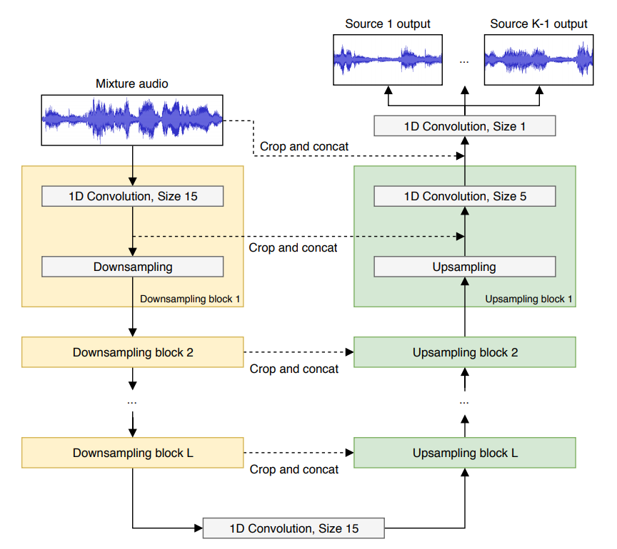

# VIMSS Visually-Informed Music Source Separation
Visually-informed Music Source Separation project @ Jeju 2018 Deep Learning Summer Camp

## Intro

Unsupervised and weakly-supervised audio-visual deep learning models have
emerged recently with an application in many tasks such as classification [[1](https://arxiv.org/pdf/1804.03160.pdf), [6](https://arxiv.org/pdf/1804.01665.pdf)], speech separation [[4]](https://arxiv.org/pdf/1804.03619.pdf),
audio source separation and localisation [[2](https://arxiv.org/pdf/1804.03641.pdf), [3](https://arxiv.org/pdf/1803.03849.pdf)].

In this project, we focus audio-visual music source separation.
Taking as a basis the models proposed in [[2]](https://arxiv.org/pdf/1804.03641.pdf) and [[3]](https://arxiv.org/pdf/1803.03849.pdf), we would like to

1. Reproduce the pipeline and results of [[2](https://arxiv.org/pdf/1804.03641.pdf), [3](https://arxiv.org/pdf/1803.03849.pdf)];
2. Make an extent for more than two sources as both work focus only on the case of one or two audio and visual sources;
3. Take advantage of integrating more advanced audio source separation models [[5]](https://arxiv.org/pdf/1712.06651.pdf) into the audio-visual pipeline.

    

## Datasets

### Evaluation datasets

1. URMP dataset https://datadryad.org//resource/doi:10.5061/dryad.ng3r749
2. Clarinet4Science dataset
3. Home-made Sound-of-Pixels dataset (by Juan Montesinos)
4. MUSDB18 as a reference
<!--- 2. Juan's SoP https://drive.google.com/drive/folders/1Gq4iHBAzZfAuM2Gej9gYpBzS3iQP9W0G --->
<!--- 3. (not sure) https://github.com/ardasnck/learning_to_localize_sound --->

### Pre-training

1. AudioSet
2. Youtube-8M dataset

## Audio Baselines

- https://github.com/f90/Wave-U-Net
- https://github.com/ShichengChen/WaveNetSeparateAudio
- https://github.com/MTG/DeepConvSep
- https://github.com/interactiveaudiolab/nussl

## Roadmap

- [x] Reproduce Wave-U-Net baseline with MUSDB (GPU/TPU)
- [x] URMP dataset preprocessing
- [x] Wave-U-Net extension for URMP dataset (multiple sources)
- [ ] Wave-U-Net conditioning for URMP dataset (with concatenation || multiplicative/additive attention)
- [ ] Segmentation and feature estimation tasks from video frames
- [ ] Writing, dissemination, demo

## Model Architecture

### Wave-U-Net

The basis of our work stems from the Wave-U-Net [[8]](https://arxiv.org/pdf/1806.03185.pdf) model implementation which performs end-to-end audio source separation with raw audio bits in time domain. Wave-U-Net model is an adaptation of the original U-Net [[9]](https://arxiv.org/pdf/1505.04597.pdf) to perform series of 1-D convolution and series of up-sampling with skip connections from encoder to decoder layer at each feature level.

    

The input to this network is a single channel audio mix, and the desired output is the separated K channels of individual audio sources, where K is the number of sources present in the audio mix. From each 2 to 3 minutes long music tracks, we split them into mini segments of 147443 samples, which comes to about 6 seconds long wav files. Then this input goes through 12 successive layers of 1D convolution down-sampling, where at each layer decimation drops the time resolution by half. At the very bottom of Wave-U-Net, number of sample drops extremely small to about only 9 samples long. Going up the U-Net, instead of using the transposed strided convolutions, linear interpolation is performed for upsampling. This preserves temporal continuity and avoids high-frequency noise in the final result. In other works, people have attempted to zero pad features maps and input before convolving to keep the original dimension size. However, in Wave-U-Net, convolutions are performed without implicit padding due to the aforementioned audio artifacts problem at segment borders. Therefore, our output result is much shorter (16839 samples) than our input (147443 samples) as a price to compute with correct audio context. On our final layer, K convolutional filters are applied the features to extract K separate source outputs.

### Resnet

### Feature-wise Transformation (Conditioning)

#### Option 1: Conditioning at every conv layer
#### Option 2: Conditioning at the bottleneck
#### Option 3: Conditioning at the output layer

## Experiments

### Batch Size
#### bfloat16
### Learning rate
#### exponential decay
### Number of sources

## Results

## Team

- *Leo Kim* (@leoybkim),  University of Waterloo
- *Olga Slizovskaia* (@veleslavia), Pompeu Fabra University

## Paper link

https://www.overleaf.com/read/mcbhdrvdwbdk

<!--- https://www.overleaf.com/17504652wxkdwdbjpvry --->

## Related work

[1]. [Hang Zhao, Chuang Gan, Andrew Rouditchenko, Carl Vondrick, Josh McDermott, Antonio Torralba. Sounds of Pixels](https://arxiv.org/pdf/1804.03160.pdf)

[2]. [Andrew Owens, Alexei A. Efros. Audio-Visual Scene Analysis with Self-Supervised Multisensory Features](https://arxiv.org/pdf/1804.03641.pdf)

[3]. [Arda Senocak, Tae-Hyun Oh, Junsik Kim, Ming-Hsuan Yang, In So Kweon. Learning to Localize Sound Source in Visual Scenes](https://arxiv.org/pdf/1803.03849.pdf)

[4]. [Ariel Ephrat, Inbar Mosseri, Oran Lang, Tali Dekel, Kevin Wilson, Avinatan Hassidim, William T. Freeman, Michael Rubinstein. Looking to Listen at the Cocktail Party: A Speaker-Independent Audio-Visual Model for Speech Separation](https://arxiv.org/pdf/1804.03619.pdf)

[5]. [Relja Arandjelovic, Andrew Zisserman. Objects that Sound](https://arxiv.org/pdf/1712.06651.pdf)

[6]. [Ruohan Gao, Rogerio Feris, Kristen Grauman. Learning to Separate Object Sounds by Watching Unlabeled Video](https://arxiv.org/pdf/1804.01665.pdf)

[7]. [Sanjeel Parekh, Slim Essid, Alexey Ozerov, Ngoc Q. K. Duong, Patrick Pérez, Gaël Richard. Weakly Supervised Representation Learning for Unsynchronized Audio-Visual Events](https://arxiv.org/pdf/1804.07345.pdf)

[8]. [Daniel Stoller, Sebastian Ewert, Simon Dixon. Wave-U-Net: A Multi-Scale Neural Network for End-to-End Audio Source Separation](https://arxiv.org/pdf/1806.03185.pdf)

[9]. [Olaf Ronneberger, Philipp Fischer, and Thomas Brox, U-Net: Convolutional Networks for Biomedical Image Segmentation](https://arxiv.org/pdf/1505.04597.pdf)

## Acknowledgements
This was supported by [Deep Learning Camp Jeju 2018](http://jeju.dlcamp.org/2018/) which was organized by [TensorFlow Korea User Group](https://facebook.com/groups/TensorFlowKR/).

## License

This project is licensed under the GNU GPL v3 License - see the LICENSE.md file for details
