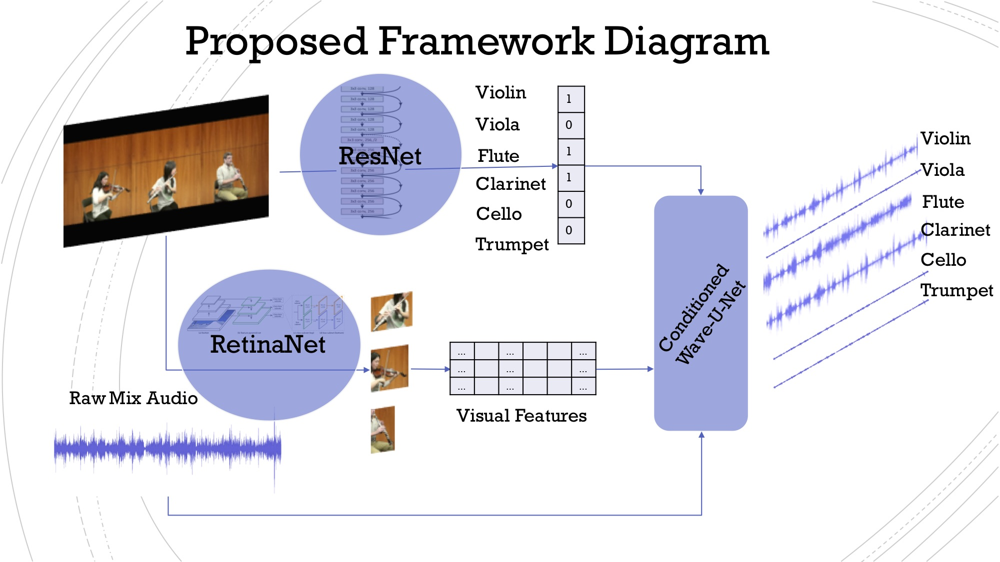

# VIMSS Visually-Informed Music Source Separation
Visually-informed Music Source Separation project @ Jeju 2018 Deep Learning Summer Camp

## Intro

Unsupervised and weakly-supervised audio-visual deep learning models have 
emerged recently with an application in many tasks such as classification [1, 6], speech separation [4], 
audio source separation and localisation [2, 3].

In this project, we focus audio-visual music source separation. 
Taking as a basis the models proposed in [2] and [3], we would like to 

1. Reproduce the pipeline and results of [2, 3]; 
2. Make an extent for more than two sources as both work focus only on the case of one or two audio and visual sources; 
3. Take advantage of integrating more advanced audio source separation models [5] into the audio-visual pipeline.

## Datasets

### Evaluation datasets

1. URMP dataset https://datadryad.org//resource/doi:10.5061/dryad.ng3r749
2. Clarinet4Science dataset
3. Home-made Sound-of-Pixels dataset (by Juan Montesinos)
4. MUSDB18 as a reference
<!--- 2. Juan's SoP https://drive.google.com/drive/folders/1Gq4iHBAzZfAuM2Gej9gYpBzS3iQP9W0G --->
<!--- 3. (not sure) https://github.com/ardasnck/learning_to_localize_sound --->

### Pre-training

1. AudioSet
2. Youtube-8M dataset

## Audio Baselines

- https://github.com/f90/Wave-U-Net
- https://github.com/ShichengChen/WaveNetSeparateAudio
- https://github.com/MTG/DeepConvSep
- https://github.com/interactiveaudiolab/nussl

## Related work

[1]. Hang Zhao, Chuang Gan, Andrew Rouditchenko, Carl Vondrick, Josh McDermott, Antonio Torralba. Sounds of Pixels

[2]. Andrew Owens, Alexei A. Efros. Audio-Visual Scene Analysis with Self-Supervised Multisensory Features

[3]. Arda Senocak, Tae-Hyun Oh, Junsik Kim, Ming-Hsuan Yang, In So Kweon. Learning to Localize Sound Source in Visual Scenes

[4]. Ariel Ephrat, Inbar Mosseri, Oran Lang, Tali Dekel, Kevin Wilson, Avinatan Hassidim, William T. Freeman, Michael Rubinstein. Looking to Listen at the Cocktail Party: A Speaker-Independent Audio-Visual Model for Speech Separation

[5]. Relja Arandjelovic, Andrew Zisserman. Objects that Sound

[6]. Ruohan Gao, Rogerio Feris, Kristen Grauman. Learning to Separate Object Sounds by Watching Unlabeled Video

[7]. Sanjeel Parekh, Slim Essid, Alexey Ozerov, Ngoc Q. K. Duong, Patrick Pérez, Gaël Richard. Weakly Supervised Representation Learning for Unsynchronized Audio-Visual Events

## Roadmap

- [x] Reproduce Wave-U-Net baseline with MUSDB (GPU/TPU)
- [x] URMP dataset preprocessing
- [x] Wave-U-Net extension for URMP dataset (multiple sources)
- [ ] Wave-U-Net conditioning for URMP dataset (with concatenation || multiplicative/additive attention)
- [ ] Segmentation and feature estimation tasks from video frames
- [ ] Writing, dissemination, demo

## Team

- *Leo Kim* (@leobkim),  University of Waterloo 
- *Olga Slizovskaia* (@veleslavia), Pompeu Fabra University

## Paper link

https://www.overleaf.com/read/mcbhdrvdwbdk

<!--- https://www.overleaf.com/17504652wxkdwdbjpvry --->

## License

This project is licensed under the GNU GPL v3 License - see the LICENSE.md file for details
